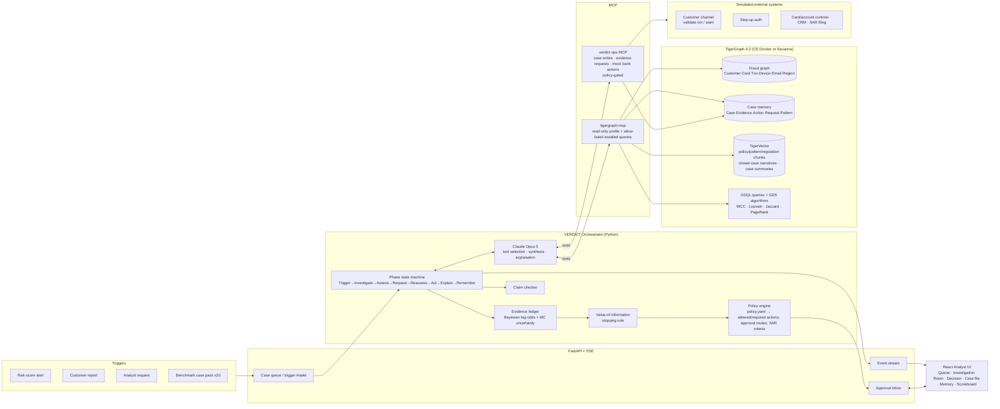

# VERDICT: Agentic Fraud Investigation on TigerGraph

> **From an uncertain signal to a defensible action.**
> Hackathon: *TigerGraph Agentic Fraud Investigation, Hacker House Goa 2026*
> Deadline: **Thu Sep 24, 2026, 11:59 PM IST**. Target: submit by **10:00 PM IST**, leaving 2 hours of buffer.

`VERDICT` is a working name (**V**alue-of-**E**vidence **R**easoning for **D**efensible **I**nvestigation of **C**ard **T**ransactions). It's easy to rename.

This document is the build plan and also a handoff spec: a fresh engineer or session should be able to build the whole MVP from it alone.

---

## 0. TL;DR

We build an investigation agent that works like a careful senior fraud analyst:

1. A **trigger** arrives: a risk-score alert, a customer report or an analyst request.
2. The agent **opens a case** and investigates **inside TigerGraph** through the **TigerGraph MCP server**, using installed GSQL queries and graph algorithms (communities, shared-entity rings, precedent lookups).
3. Every finding goes into a **Bayesian evidence ledger**. Each piece of evidence shifts the fraud probability by an amount **learned from 5,565 closed cases**, so the probability is calibrated, not guessed.
4. The agent decides whether to act or keep looking using **value of information**. It requests more evidence (step-up auth, customer validation, analyst input) only when that evidence could **change the decision** and is worth its cost. That gives a principled answer to "when is there enough evidence to act?".
5. A **policy engine**, compiled from the bank's fraud policy, is the final authority. The LLM *recommends*, the policy decides what is *allowed*, and high-impact actions go to a **human approval inbox**. Least privilege is enforced at three layers: database, MCP and policy.
6. The agent writes an **explainable case file** with before- and after-evidence recommendations, approval routes and a **fact-checked SAR** when policy requires one. It writes the case back to the graph as **memory** that improves later investigations.
7. **Undocumented fraud patterns** are discovered with graph community detection and named by the LLM. The challenge brief says outright that not every pattern is documented.
8. An **analyst UI** shows the investigation live: the graph growing, the fraud probability moving step by step, and the decision changing as evidence arrives.

We also **measure** ourselves: a backtest on held-out closed cases reports accuracy and calibration. Most teams won't have this.

---

## 1. How we win each judging line

| Criterion (weight) | What judges want | How VERDICT scores |
|---|---|---|
| **Investigation accuracy (25%)** | Correct fraud patterns; good evidence | Pattern signatures for all 5 documented patterns in GSQL, plus undocumented-pattern discovery (§11.4). Likelihood ratios calibrated on 5,565 labelled closed cases. Precedent retrieval from similar past cases. Backtest scoreboard proves accuracy (§14). |
| **Next best action (25%)** | Handles ambiguity, knows when more evidence is needed, updates recommendations | Value-of-information stopping rule plus a **decision stability** metric. Explicit **before-evidence and after-evidence** recommendations, **counterfactual branches** ("if the customer confirms → X; if they deny → Y; no reply in 24h → Z"), and exact policy action identifiers and approval routes. |
| **Case summary & explainability (10%)** | Clear case record, reasoning, evidence | Evidence ledger (each item's effect on the log-odds, with its source query), a case timeline, cited policy clauses, and a **claim checker** that verifies every number and ID the LLM writes. |
| **Agentic design & engineering (15%)** | Architecture, tools, orchestration, memory, controls, permissions | A phased state machine with an LLM tool loop inside each phase. Two MCP servers (TigerGraph read-only and our ops server). Policy gate, human-in-the-loop approvals, audit log, graph-native memory that updates from outcomes, budgets and fallbacks. |
| **Innovation (15%)** | Original use of graph, AI, GraphRAG and agents | Decision-theoretic evidence gathering; hybrid GraphRAG that fuses vector, structural and precedent retrieval; pattern discovery via Louvain/WCC; grounded SARs; a memory that updates its likelihoods as cases resolve. |
| **Demo (10%)** | Clear end-to-end demo | A purpose-built "Investigation Room" UI with live streaming, a graph view and a belief-trajectory chart. The 3–5 minute video is scripted around three cases: clear fraud, ambiguous, and false positive. |

---

## 2. The standout strategy

At least 15 public repos already target this task. Most follow the same recipe: LangGraph, TigerGraph, "GraphRAG", a dashboard, threshold rules and a SAR prompt. We stand out through **rigour and measurable reasoning**, not a longer feature list.

| # | Differentiator | Why it's hard to copy in a weekend | Priority |
|---|---|---|---|
| D1 | **Calibrated Bayesian evidence ledger**: likelihood ratios per signal learned from closed cases, with a posterior and 80% credible interval | Needs real statistics on the closed-case history; every step of the belief is explainable | MUST |
| D2 | **Value-of-information stopping rule + decision stability**: request evidence only when it could flip the decision and is worth the cost | Directly answers the hardest part of the brief ("decide when there is enough information to act") | MUST |
| D3 | **Least privilege, defense in depth**: TigerGraph RBAC read-only profile, MCP `--allowed-tools` filtering, a policy gate and a human approval inbox | The LLM *cannot* freeze an account, by construction rather than by prompt | MUST |
| D4 | **Backtest scoreboard**: time-split holdout of closed cases; AUC, Brier score, pattern accuracy and action agreement, shown in the UI and the blog | Proves accuracy instead of claiming it | MUST |
| D5 | **Undocumented-pattern discovery**: community detection on the entity graph plus residual clustering of fraud cases the 5 known patterns don't explain, named by the LLM and stored as `Pattern{status: HYPOTHESIS}` | The brief hints at hidden patterns | SHOULD |
| D6 | **Learning memory**: resolving a case updates the likelihood statistics in the graph, and the next similar case's recommendation shifts (shown live in the demo) | "Use prior outcomes to improve future decisions", made visible | SHOULD |
| D7 | **Grounded outputs**: a claim checker rejects any number, amount, date or ID in LLM text that isn't in the evidence store, then regenerates | Hallucination-safe SARs | SHOULD |
| D8 | **Counterfactual decision branches** for every evidence request | Makes before/after reasoning explicit | MUST (cheap once D2 exists) |

---

## 3. Architecture



### Component responsibilities

| Component | Responsibility | Tech |
|---|---|---|
| **TigerGraph** | Stores the transaction graph, case memory and vectors; runs all traversal and pattern queries and algorithms | TG 4.2.x Community Edition in Docker (dev/demo) or Savanna |
| **tigergraph-mcp** (official) | Exposes graph capabilities to the agent: `run_installed_query`, `search_top_k_similarity`, `get_node_edges`, `get_neighbors`, schema discovery | `tigergraph-mcp==1.0.3` over stdio, profile `investigator` |
| **verdict-ops MCP** (ours) | The only path to side effects: `open_case`, `add_finding`, `request_evidence`, `propose_action`, `execute_action`, `file_sar`. Every call goes through the policy gate | `mcp` FastMCP server, TG profile `ops` |
| **Orchestrator** | Deterministic phase machine; runs the LLM tool loop per phase with budgets; turns tool results into typed Evidence; emits events | Python 3.11, custom (no framework lock-in) |
| **Evidence ledger / VOI / Policy** | Deterministic maths and rules; the LLM can't override them | numpy, pydantic, PyYAML |
| **LLM** | Plans which evidence to gather, interprets it, handles nuance (customer free text), writes explanations, case summaries and SARs | Anthropic SDK, `claude-opus-5` |
| **GraphRAG** | Retrieves policy/typology/regulation chunks and precedent cases; expands them through the graph; packs a compact context for the LLM | TigerVector + GSQL + fusion ranker |
| **API** | Trigger intake, SSE event stream, approvals, case CRUD, benchmark runner | FastAPI, sse-starlette |
| **UI** | Analyst experience and demo | Vite, React, TypeScript, Tailwind, Cytoscape.js, Recharts |

**Why a custom orchestrator instead of LangGraph or CrewAI?** Our control flow is fixed by the brief (Trigger → … → Update memory), and the interesting logic (ledger, VOI, policy) is deterministic code. A small explicit state machine is easier to audit, test and explain in the blog. The LLM tool loop inside each phase uses the Anthropic SDK directly with MCP tools. The brief explicitly allows a custom agent.

---

## 4. Model choices

| Role | Model | Settings | Why |
|---|---|---|---|
| **Investigator / reasoner** (tool selection, assessment, next-best-action rationale, case summary, SAR narrative) | **`claude-opus-5`** | Adaptive thinking; `effort: high` for investigate/assess and `medium` for summaries; structured outputs (`output_config.format` / `messages.parse`) for every machine-read result; prompt caching on the stable prefix (system prompt, policy digest, tool definitions); server-side refusal fallback enabled | Best available tool-use and long-horizon reasoning. Judges score reasoning quality and explanation, not token cost. |
| **Bulk worker** (offline: compress about 5.5K closed-case narratives into "memory cards", label discovered clusters) | **`claude-haiku-4-5`** via the **Message Batches API** (50% cheaper) | No thinking; structured JSON | Cheap, fast, runs once offline |
| **Embeddings** (policy/pattern/regulation chunks, case narratives, case summaries) | **`BAAI/bge-small-en-v1.5`** (384-d) via `fastembed` (ONNX, CPU, no API key) | Pluggable: Voyage AI, or a TF-IDF+SVD fallback for fully offline runs | Anthropic has no embeddings endpoint; a local model is free, reproducible and fast for about 10K documents |
| **Numeric reasoning** | *No LLM*: GSQL + statistics | | The brief wants the LLM to reason, choose tools and synthesise, **not** replace graph analysis |

Model IDs live in `.env` (`VERDICT_MODEL`, `VERDICT_WORKER_MODEL`), so switching models is a one-line change.

**Cost estimate (Opus 5 at $5 per million input tokens and $25 per million output tokens; cache reads are much cheaper):**
about 8–12 LLM calls per case, about 120K input tokens (mostly cached) and about 12K output tokens, so roughly **$0.40–0.80 per case**.
20 benchmark cases come to about $15. Development iteration and backtest samples add about $30–60. The Haiku batch for narratives is about $3.
**Budget: about $80 in API credit.**

---

## 5. Data and graph model

### 5.1 Dataset (HHGOA_IEEE)

What we know so far, from the brief and from public write-ups. The **dataset README is authoritative** and gets read first.

- `transactions.csv`: about 590,742 card transactions over 6 months, about 13.5K customers. Every original IEEE-CIS column is kept (TransactionAmt, ProductCD, card1–6, addr1/2, dist1/2, P_/R_emaildomain, C1–14, D1–15, M1–9, V1–339). Added fields: `customer_id`, calendar timestamp, channel and `risk_score` (0–1, useful but imperfect). **There is no is_fraud flag, no merchant ID and no card ID on the transaction row.**
- `identity.csv`: about 144K identity rows for online transactions (id_01–id_38, DeviceType, DeviceInfo; proxy and new-device flags live here).
- `closed_cases_history.csv`: 5,565 closed cases from months 1–4 (**4,665 confirmed fraud, 900 cleared**), with card IDs and involved/connected transactions, and probably pattern, action and narrative fields (to confirm).
- `case_pack.csv`: **the 20 benchmark triggers** from months 5–6.
- Documents: bank fraud policy (exact action identifiers and approval routes), five known fraud patterns, regulatory references (SAR).
- ⚠️ Using the original Kaggle IEEE-CIS files to recover outcomes is **grounds for disqualification**. We never touch them.

**Known fraud patterns (early intel, to be verified in the README):**

| # | Pattern | Graph signature we'll compute |
|---|---|---|
| P1 | **Card testing**: 3 or more small online authorisations on one card within an hour, then a larger purchase | Card→Txn time window: count and sum of small auths, followed by a larger amount; the policy mentions STEP_UP_AUTH, and BLOCK_CARD if a purchase over $100 has already cleared |
| P2 | **Card-not-present fraud from a new device**: same-day, the device is new for the account, sometimes behind a proxy | Txn→Device first-seen for the customer, device sharing degree, proxy flag, same-day cluster |
| P3 | **Out-of-region use**: card-present purchases in a billing region with no history while home activity continues | Region novelty for the customer plus concurrent home-region activity inside a time window |
| P4 | **Account takeover**: mixed-channel activity inconsistent with the cardholder, with device and match-flag anomalies (stolen credentials) | Channel mix deviation, M-flag mismatches, device change, email change |
| P5 | *(TBD from README)*, possibly **shared-entity / ring fraud** | Several cards linked through the same device profile, billing region or recipient email; policy mentions FILE_REPORT + CREATE_CASE |
| P? | **Undocumented pattern(s)** | Discovered (§11.4) |

### 5.2 Graph schema (draft, finalised after profiling)

```
VERTEX Customer   (PRIMARY_ID customer_id, home_region, first_seen, n_txn, amt_mean, amt_std, amt_p95, online_ratio, community_id)
VERTEX Card       (PRIMARY_ID card_id, card1, card2, card3, card4 /*network*/, card5, card6 /*debit|credit*/, community_id, pagerank)
VERTEX Transaction(PRIMARY_ID txn_id, ts DATETIME, amount DOUBLE, product_cd, channel, risk_score DOUBLE,
                   is_online BOOL, dist1, dist2, m_flags STRING, c_feats LIST<DOUBLE>, d_feats LIST<DOUBLE>,
                   is_proxy BOOL, device_new_flag BOOL, id_feats STRING)
VERTEX Device     (PRIMARY_ID device_key /*hash(DeviceInfo, OS, browser, screen)*/, device_type, device_info, os, browser, screen, n_customers, fraud_case_cnt)
VERTEX EmailDomain(PRIMARY_ID domain, n_customers, fraud_case_cnt)
VERTEX Region     (PRIMARY_ID region_key /*addr1|addr2*/, fraud_case_cnt)

VERTEX Case       (PRIMARY_ID case_id, source /*HISTORY|BENCHMARK|LIVE*/, trigger_type, status, opened_at, closed_at,
                   outcome /*CONFIRMED_FRAUD|CLEARED|OPEN*/, pattern, p_fraud, ci_low, ci_high, stability,
                   summary STRING, summary_emb LIST<FLOAT> /* or VECTOR attr */)
VERTEX Evidence   (PRIMARY_ID evidence_id, kind, value STRING, llr DOUBLE, source_tool, ts)
VERTEX EvidenceRequest(PRIMARY_ID request_id, kind /*STEP_UP_AUTH|CUSTOMER_VALIDATION|ANALYST_INFO*/, status, response, requested_at, answered_at)
VERTEX Action     (PRIMARY_ID action_id, code /*exact policy identifier*/, phase /*BEFORE_EVIDENCE|AFTER_EVIDENCE*/,
                   status /*RECOMMENDED|PENDING_APPROVAL|APPROVED|EXECUTED|REJECTED*/, approval_route, rationale, ts)
VERTEX Pattern    (PRIMARY_ID pattern_id, name, status /*DOCUMENTED|HYPOTHESIS*/, description, signature_json)
VERTEX DocChunk   (PRIMARY_ID chunk_id, doc_type /*POLICY|PATTERN|REGULATION|NARRATIVE*/, section, text, emb VECTOR(384))
VERTEX FeatureStat(PRIMARY_ID feature_key, n_fraud_pos, n_fraud_neg, n_clear_pos, n_clear_neg, updated_at)

DIRECTED EDGE HAS_CARD (Customer → Card)           DIRECTED EDGE PAID_WITH (Transaction → Card)
DIRECTED EDGE MADE     (Customer → Transaction)    DIRECTED EDGE USED_DEVICE (Transaction → Device)
DIRECTED EDGE PURCHASER_EMAIL (Transaction → EmailDomain)   DIRECTED EDGE RECIPIENT_EMAIL (Transaction → EmailDomain)
DIRECTED EDGE BILLED_IN (Transaction → Region)     DIRECTED EDGE HOME_REGION (Customer → Region)
DIRECTED EDGE CASE_TXN (Case → Transaction, role /*TRIGGER|INVOLVED|CONNECTED*/)
DIRECTED EDGE CASE_CARD (Case → Card, role)        DIRECTED EDGE CASE_CUSTOMER (Case → Customer)
DIRECTED EDGE CASE_PATTERN (Case → Pattern, score) UNDIRECTED EDGE SIMILAR_CASE (Case — Case, score, basis)
DIRECTED EDGE HAS_EVIDENCE (Case → Evidence)        DIRECTED EDGE HAS_REQUEST (Case → EvidenceRequest)
DIRECTED EDGE HAS_ACTION (Case → Action)           DIRECTED EDGE CITES (Action|Evidence → DocChunk)
DIRECTED EDGE DESCRIBES (DocChunk → Pattern|Case)
```

- `card_id` derivation: the README explains how card IDs map to transactions (they appear in the case pack and history). If there's no direct key, we derive a card fingerprint from `customer_id + card1..card6` and validate it against the card IDs in closed cases.
- We don't load all 339 V columns into the graph. We keep a profiled subset (top-k by mutual information with closed-case outcomes) as a compact list attribute.
- Scale: about 590K transactions, about 13.5K customers, about 3–4M edges. Loading into CE takes a few minutes.

### 5.3 Loading pipeline

1. `verdict profile`: pandas profiling of every file; writes `docs/data_profile.md` (nulls, cardinalities, time ranges, joins).
2. `verdict prepare`: builds normalised CSVs (vertex and edge files), device keys, region keys, card fingerprints and per-customer baselines (as of each month, to avoid leakage).
3. `verdict tg-init`: creates the graph, schema, vector attributes and roles (`investigator` read-only, `ops` writer).
4. `verdict load`: GSQL loading jobs via `pyTigerGraph.runLoadingJobWithFile`, which is idempotent.
5. `verdict install`: installs all GSQL queries and the GDS algorithms we use.
6. `verdict algos`: runs WCC, Louvain, PageRank and degree, and writes `community_id` and `pagerank` attributes.
7. `verdict ingest-docs`: chunks the policy, pattern and regulation docs and the closed-case narratives, embeds them and upserts them into TigerVector.
8. `verdict calibrate`: learns likelihood ratios and the risk-score calibration from closed cases and writes `FeatureStat` vertices plus `artifacts/calibration.json`.

---

## 6. Graph intelligence: the GSQL toolbox

All investigation queries are **read-only installed queries**, exposed to the LLM through `tigergraph__run_installed_query` with an allow-list. Each returns compact JSON with pre-computed signals, never raw row dumps.

| Query | Inputs | Returns | Serves |
|---|---|---|---|
| `inv_txn_context` | txn_id | Transaction, card, customer, device, emails, region, risk_score, identity flags | Every case |
| `inv_card_velocity` | card_id, t0, window_min=60, small_amt | Count and sum of small auths in the window, the following larger purchase, whether it cleared | P1 card testing |
| `inv_customer_baseline` | customer_id, t0, lookback_days | Amount z-score, hour-of-day deviation, channel mix, usual regions and devices, days since last txn | Account behaviour, P4 |
| `inv_device_profile` | txn_id | Device first seen for this customer? Number of customers and cards on the device, proxy, device fraud-case count | P2, rings |
| `inv_region_profile` | card_id, txn_id, window_h | Region novelty, concurrent home-region activity (overlapping window), distance fields | P3 |
| `inv_identity_consistency` | txn_id | M-flag mismatches, purchaser vs recipient email mismatch, new email, channel switch | P4 ATO |
| `inv_linked_entities` | card_id, depth≤2, window_days | Cards and customers sharing a device, email or region; how many have confirmed-fraud cases | P5 rings, FILE_REPORT criteria |
| `inv_prior_cases` | customer_id, card_id | Direct and entity-linked closed cases with outcome, pattern and actions | Memory, precedent |
| `inv_similar_cases_struct` | txn_id, k | Top-k closed cases by Jaccard overlap of entity neighbourhoods, with outcomes | GraphRAG precedent |
| `inv_community` | card_id | Community id, size, fraud density, hub devices and emails (from Louvain/WCC) | Rings, discovery |
| `inv_pattern_signatures` | txn_id | All documented pattern signatures in one pass, with strengths | Pattern classification |
| `inv_exposure` | customer_id, card_id, t0 | Money at risk: recent and pending amounts, other cards of the customer, spend velocity | Loss model, BLOCK_ALL_CARDS justification |
| `mem_case_timeline` | case_id | Evidence, requests, actions and decisions in order | UI, explanation |

**Graph algorithms** (from the TigerGraph GDS library `gsql-graph-algorithms`, precomputed):
- `tg_wcc` and `tg_louvain` on the Card–Device–Email–Region projection: fraud-ring communities and pattern discovery.
- `tg_pagerank` / degree centrality on Device and EmailDomain: "hub" entities touching many customers.
- `tg_jaccard_nbor_ss`: structural case similarity (precedent retrieval).
- *Stretch:* `tg_fastRP` card embeddings, with cosine similarity to known fraud cards as another signal.

---

## 7. GraphRAG design

The brief asks us to "pass relevant context to the LLM rather than raw data". Our retriever builds a **Context Pack** of about 3–6K tokens per phase:

1. **Semantic retrieval** (TigerVector `search_top_k_similarity`): the query is built from the trigger and current findings. It returns policy clauses, pattern definitions, regulation passages and closed-case narratives.
2. **Graph expansion**: retrieved case chunks are expanded through `DESCRIBES → Case → CASE_CARD/CASE_TXN → entities`. We keep them only if they **share entities with, or have structural similarity to**, the current subgraph.
3. **Structural precedent retrieval**: `inv_similar_cases_struct` and `inv_prior_cases`.
4. **Fusion ranking**: reciprocal rank fusion over (1) and (3), plus boosts for shared entities, the same pattern and recency. The top precedent cases are shown with their **outcome and the analyst's decision**.
5. **Compression**: each precedent becomes a 2–3 line memory card (pre-generated offline by Haiku). Each policy clause is quoted with its clause ID so the LLM can cite it.

The Context Pack records every item's provenance (vector hit, graph hop or structural match), and the UI shows *why* each item was retrieved.

---

## 8. Agent design

### 8.1 Phase state machine (orchestrator)

```
TRIGGERED → INVESTIGATING → ASSESSED ─┬─(VOI says act)──────────────→ DECIDED → EXPLAINED → REMEMBERED → (CLOSED | PENDING_APPROVAL)
                                      └─(VOI says ask)→ AWAITING_EVIDENCE → REASSESSED → DECIDED → …
```

| Phase | What happens | LLM role | Deterministic role |
|---|---|---|---|
| **Trigger** | Normalise the trigger (RISK_SIGNAL / CUSTOMER_REPORT / ANALYST_REQUEST); resolve seed entities | Parse free-text customer reports into structured claims (treated as untrusted data) | Validate IDs, dedupe against open cases |
| **Open case** | `ops.open_case`: creates the Case vertex and links the seed entities | – | Policy check (CREATE_CASE criteria) |
| **Investigate** | Bounded tool loop (≤12 tool calls, parallel allowed). A **mandatory core** runs first (context, pattern signatures, baseline, prior cases); the LLM then picks follow-ups (ring expansion, other cards, exposure) based on what it sees | Plans and picks tools, forms hypotheses | Each tool result goes through a typed **Evidence extractor** into ledger updates and events |
| **Assess** | Posterior p(fraud), 80% credible interval, pattern probabilities, novelty flag, decision stability | Writes the assessment narrative and ranks hypotheses (including "legitimate" alternatives: travel, new phone) | Ledger maths, Monte Carlo uncertainty |
| **Decide (before evidence)** | Candidate actions → policy engine → allowed/required set + approval routes. VOI over evidence actions | Rationale per action, citing evidence IDs and policy clause IDs | Loss model, VOI, policy |
| **Request evidence** | `ops.request_evidence(kind)`; status AWAITING_EVIDENCE; counterfactual branches recorded | Drafts the customer or analyst message | Policy permits? Rate limits |
| **Reassess** | The response arrives (case pack, simulator or UI click) → ledger update → new posterior | Interprets free-text responses | LR update |
| **Decide (after evidence)** | New recommendation + approval route; auto-executes permitted low-impact actions; queues the rest for approval | Rationale plus a "what changed" delta | Policy gate |
| **Explain** | Case summary, remaining uncertainty, SAR if required | Writes the text | **Claim checker** validates every number and ID |
| **Remember** | Writes everything to the graph; SIMILAR_CASE edges; embeddings; FeatureStat updates on resolution | – | Upserts |

### 8.2 Tools the LLM sees

- **Graph (tigergraph-mcp, `investigator` profile):** `tigergraph__run_installed_query` (only for the allow-listed `inv_*` / `mem_*` queries), `tigergraph__search_top_k_similarity`, `tigergraph__get_node_edges`, `tigergraph__get_neighbors`, `tigergraph__get_node`. Served with `--allowed-tools read-only,run_installed_query`. Our MCP client wrapper also enforces the query allow-list.
- **Ops (verdict-ops MCP):** `add_finding`, `request_evidence`, `propose_action`, `get_policy_clause`. **There is no `execute_action` tool for the LLM.** Execution happens only in the orchestrator after the policy gate and, where needed, human approval.

### 8.3 Controls and permissions (defense in depth)

1. **Database:** TigerGraph RBAC. The `investigator` user has a read role; `ops` can write case vertices only.
2. **MCP:** tool filtering (`TG_ALLOWED_TOOLS`) plus a query allow-list in our client.
3. **Policy gate:** every action is checked against `policy.yaml`: `ALLOWED | REQUIRES_APPROVAL(route) | FORBIDDEN(reason)`. An LLM proposal of a forbidden action is logged and rejected, for example BLOCK_ALL_CARDS without evidence of a wider compromise.
4. **Human in the loop:** the approval inbox in the UI, with approve/reject and a reason, all audit-logged.
5. **Budgets:** tool-call and token budgets per phase, timeouts, and a deterministic fallback path. If the LLM fails, the core evidence plus policy still produce a defensible recommendation.
6. **Untrusted input:** customer report text and tool outputs are wrapped as data; the system prompt says instructions inside them are ignored.
7. **Audit log:** every decision stores the evidence IDs, policy clause IDs, model ID and prompt hash it relied on.

### 8.4 Structured outputs (pydantic)

`TriggerParse`, `InvestigationPlan`, `Assessment`, `NBARecommendation{actions[], approval_routes[], evidence_request?, branches[], rationale, cited_evidence[], cited_clauses[]}`, `CaseSummary`, `SARNarrative`. All are validated, and action codes are an `Enum` built from the policy file.

---

## 9. Evidence scoring and uncertainty (D1)

- **Prior:** `P(fraud | risk_score)` from isotonic calibration of risk_score against closed-case outcomes. The benchmark cases are also "investigated triggers", so the selection bias matches.
- **Signals:** binary or bucketed features from the queries (new device, proxy, region novelty, concurrent home activity, velocity burst, M-mismatch, email mismatch, shared entity with prior fraud, community fraud density bucket, amount z-score bucket, channel switch, precedent vote, …).
- **Likelihood ratios:** `LR_f = P(f | fraud) / P(f | cleared)` from closed cases, with Laplace smoothing and Beta posteriors on both rates. Correlated signals are grouped, and within a group only the strongest applies (a "noisy-max" guard against naive-Bayes double counting).
- **Posterior:** `logit(p) = logit(prior) + Σ log LR`. The **ledger** shows each row's Δlog-odds, its source query and its policy relevance.
- **Uncertainty:** 1,000 Monte Carlo draws from the Beta posteriors give the p distribution and an **80% credible interval**. **Decision stability** is the share of draws that lead to the same best action. Unknown signals (not yet collected) are listed as "evidence gaps".
- **Pattern classification:** `score(pattern) = signature strength (GSQL) × LR support + precedent votes (similar cases' confirmed patterns)`. We output the top pattern with its probability and alternatives. **NOVEL** is flagged when p(fraud) is high but no documented signature explains it, which links to the discovered hypotheses (§11.4).
- The calibration job also exports a **reliability diagram** for the scoreboard.

---

## 10. Next-best-action engine (D2, D8)

### 10.1 Policy engine

`verdict/policy/policy.yaml` is written by hand from the bank's policy document. Every rule carries the policy clause ID:

```yaml
actions:           # exact identifiers from the policy
  DECLINE_TRANSACTION: {impact: high, approval: ANALYST}          # routes TBD from policy
  BLOCK_CARD:          {impact: high, approval: ANALYST}
  BLOCK_ALL_CARDS:     {impact: critical, approval: SENIOR, requires: [wider_compromise]}
  MONITOR_CARD:        {impact: low, approval: AUTO}
  STEP_UP_AUTH:        {impact: low, approval: AUTO, kind: evidence}
  ...
rules:
  - id: POL-CT-1   # card testing
    when: "pattern == 'CARD_TESTING' and small_auths_1h >= 3"
    recommend: [STEP_UP_AUTH]
  - id: POL-CT-2
    when: "pattern == 'CARD_TESTING' and cleared_purchase_amt > 100"
    recommend: [BLOCK_CARD]
  - id: POL-NR-1   # no reply
    when: "evidence.CUSTOMER_VALIDATION == 'NO_REPLY_24H'"
    recommend: [DECLINE_TRANSACTION, MONITOR_CARD]
  - id: POL-RING-1
    when: "linked_fraud_cards >= 2 and shared_entity in ['device','region','recipient_email']"
    recommend: [CREATE_CASE, FILE_REPORT]
sar:
  - id: REG-SAR-1
    when: "..."    # thresholds from the regulatory references
```

The engine evaluates the rules safely (a small expression evaluator over a fact dict, no `eval`). It returns **required**, **allowed** and **forbidden** actions plus the approval route for each.

### 10.2 Value-of-information stopping rule

- **Loss model:** `L(block | legit)` = customer friction plus churn proxy (configurable, e.g. $30); `L(allow | fraud)` = exposure from `inv_exposure` (transaction amount plus expected follow-on loss); a delay cost per hour waiting for evidence.
- **Evidence actions** `e ∈ {STEP_UP_AUTH, CUSTOMER_VALIDATION, ANALYST_INFO}` with outcome likelihoods `P(o | fraud)` and `P(o | legit)` (from the policy/README, closed-case evidence if present, or documented assumptions).
- `EVSI(e) = min_a E[L(a)] − Σ_o P(o)·min_a E[L(a) | o] − cost(e)`
- **Rule:** request the evidence with the largest positive EVSI if the policy permits it. **Stop and act** when every EVSI is ≤ 0 **and** decision stability is ≥ 0.9, or when the policy mandates an action.
- **Output for every case:**
  - **NBA_before**: actions and approval routes before any evidence is requested (the brief requires this to be recorded)
  - **Evidence request** with *why*, e.g. "a step-up result would move p from 0.41 to 0.88 on fail or 0.07 on pass; expected loss falls from $212 to $38"
  - **Branches**: confirm / deny / no reply mapped to the resulting NBA
  - **NBA_after**: the actual recommendation once the response is received (the brief requires this too)

---

## 11. Case management and memory (D5, D6)

### 11.1 Case record
Case vertex plus Evidence, EvidenceRequest and Action vertices and a status history. **Every benchmark case is written to the graph**, as the brief requires. The JSON answer file mirrors the graph record.

### 11.2 Similar-case retrieval
Fusion of (a) vector similarity on the case summary embedding, (b) structural Jaccard similarity of entity neighbourhoods, and (c) the same pattern and shared entities. Stored as `SIMILAR_CASE` edges with a `basis` attribute.

### 11.3 Learning loop
When a case resolves (analyst decision in the UI, or an outcome), `learning.update(case)` increments `FeatureStat` counts for each observed signal. The LRs and calibration are recomputed incrementally. **Demo moment:** resolve case A as fraud, then open a similar case B; B's ledger shows the updated LR and a higher p(fraud), and the UI notes "learned from Case A".
Recurring-entity watchlist: devices, emails and regions linked to 2 or more confirmed-fraud cases get flagged and surface as evidence in new cases.

### 11.4 Undocumented-pattern discovery (offline job `verdict discover`)
1. Compute the documented-pattern signatures for every confirmed-fraud closed case, and take the **residual** cases (no signature above threshold).
2. Build feature vectors for the residuals (graph and behaviour features) plus their Louvain community membership; cluster them (HDBSCAN or k-means with silhouette selection).
3. For each cluster, compute its distinguishing features (lift vs all fraud) and the entities it shares.
4. Haiku/Opus writes a typology hypothesis (name, description, signature, suggested policy mapping), stored as `Pattern{status: HYPOTHESIS}` with `DESCRIBES` edges to example cases.
5. The classifier can then label a new case **"Undocumented pattern: <name> (hypothesis, n=… precedent cases)"**. Undocumented patterns are always escalated to an analyst, never auto-actioned.

---

## 12. SAR and answer files

- **Answer file per benchmark case**: `outputs/answers/<case_id>.json` in **exactly** the README's answer format (validated with a JSON Schema derived from the README), plus a human-readable `outputs/answers/<case_id>.md`. Content:
  - the case (internal investigation record, evidence, findings, decisions, actions taken)
  - `nba_before_evidence` and its approval route, and `nba_after_evidence` and its approval route
  - a SAR when the policy requires one
  - confirmation that the case was written to the graph (case_id, vertex counts)
- **SAR generator:** a template of FinCEN-style sections (subject, activity summary, who/what/when/where/why/how narrative, evidence references, actions taken). The narrative is LLM-written from the ledger only, then **claim-checked**: every amount, date, ID and count must match the evidence store, otherwise it is regenerated with feedback.
- `verdict run-benchmark` runs all 20 cases end to end. It is resumable and idempotent, and writes a summary `outputs/benchmark_summary.md`.

---

## 13. UI (Investigation Room)

A single-page React app served by FastAPI.

| View | Contents |
|---|---|
| **Case Queue** | The 20 benchmark triggers plus "New trigger" (risk alert, customer report text box, analyst request). Status chips: OPEN, AWAITING_EVIDENCE, PENDING_APPROVAL, CLOSED |
| **Investigation Room** (hero) | **Left:** live agent timeline (phase, MCP tool call, GSQL query, finding) over SSE. **Centre:** Cytoscape graph that grows as the agent traverses; fraud-linked entities in red, precedent cases as ghost nodes. **Right:** **belief meter** (p with CI band), **belief trajectory** chart across steps, **evidence ledger** bars (Δlog-odds), pattern probabilities, decision stability |
| **Decision Panel** | NBA_before with approval routes and policy citations → **evidence request card** with counterfactual branches → simulated response buttons (Confirm / Deny / No reply / Step-up pass / Step-up fail) → NBA_after with a "what changed" diff → **Approve / Reject** (human in the loop) |
| **Case File** | Full record, audit log, SAR draft (rendered, downloadable), graph write-back confirmation |
| **Memory & Patterns** | Similar cases with outcomes, watchlist entities, discovered pattern hypotheses with examples |
| **Scoreboard** | Backtest metrics, reliability diagram, pattern confusion matrix, action agreement |

Design goal: a clean, dark "analyst console" look. Every number is clickable back to its evidence.

---

## 14. Evaluation harness (D4)

- **Split:** closed cases from months 1–3 are used to fit (LRs, calibration); month 4 is held out. Nothing from months 5–6 is used for fitting (the benchmark lives there).
- **Deterministic engine (all holdout cases):** AUC and Brier score for fraud vs cleared, pattern accuracy (if the history has pattern labels), action agreement with analyst actions (if present), and the false-positive rate at the chosen thresholds.
- **Full agent (30 sampled holdout cases, LLM on):** NBA agreement, share of cases where evidence was requested vs needed, average tool calls, cost and latency.
- The results go to `docs/scoreboard.md`, the UI Scoreboard and the blog.
- **Regression tests:** pytest on the policy engine (every rule), ledger maths, VOI, answer-file schema and claim checker, plus a golden test on a tiny synthetic graph.

---

## 15. Repository layout

```
PLAN.md                     ← this file
README.md                   ← quickstart, architecture, screenshots
docker-compose.yml          ← tigergraph + api + ui (one-command demo)
.env.example                ← TG_*, ANTHROPIC_API_KEY, VERDICT_MODEL, …
graph/
  schema.gsql  roles.gsql  loading/*.gsql  queries/*.gsql  algorithms/install.sh
verdict/                    ← Python package
  cli.py  config.py
  tg/            client.py loader.py installer.py
  data/          profile.py prepare.py
  calibrate/     features.py calibration.py
  rag/           embed.py chunker.py retriever.py context_pack.py
  policy/        policy.yaml engine.py
  scoring/       ledger.py uncertainty.py voi.py
  agent/         orchestrator.py llm.py mcp_client.py extractors.py prompts/ schemas.py guards.py
  ops_mcp/       server.py mock_bank.py
  memory/        case_store.py similar.py learning.py discover.py
  outputs/       answer_writer.py sar.py claim_checker.py
  eval/          backtest.py
  api/           app.py events.py
ui/                         ← Vite + React + TS
tests/
data/                       ← raw dataset (gitignored) + data/sample (tiny synthetic fixture)
outputs/answers/            ← the 20 submission answer files (committed)
docs/                       ← data_profile.md, scoreboard.md, blog.md, demo_script.md, architecture.png
```

Dataset files are **never committed** to the public repo. The license and competition rules apply.

---

## 16. Build plan and timeline

Times are IST. "Me" = Claude building in this cloud session; "You" = the team lead.
I build continuously, including overnight, and commit and push after every milestone to `claude/adoring-planck-l669wa`.

| Phase | Window (IST) | Owner | Tasks | Exit criteria |
|---|---|---|---|---|
| **P0 Prereqs** | Wed 14:30 → 16:00 | **You** | §17 steps 1–4 (dataset to me, API key, TigerGraph account) | I can read the README and data; the key is available |
| **P1 Foundation** | Wed 16:00 → 20:00 | Me | Scaffold repo; read README; `profile`; finalise schema; `prepare`; TigerGraph CE in my sandbox; `tg-init`, `load`, `install`; doc ingestion + embeddings; `.env.example` | Full graph loaded; counts match the README; vector search works |
| **P2 Graph intelligence + scoring** | Wed 20:00 → Thu 01:00 | Me | All `inv_*` GSQL queries + tests; GDS algorithms (WCC, Louvain, PageRank, Jaccard); feature extraction; calibration; ledger; Monte Carlo uncertainty; policy.yaml + engine; VOI; backtest v1 | `docs/scoreboard.md` v1; policy tests green |
| **P3 Agent** | Thu 01:00 → 07:00 | Me | MCP client (tigergraph-mcp) + verdict-ops MCP; orchestrator phases; prompts + structured outputs; GraphRAG retriever + context pack; case write-back; SAR + claim checker; answer writer; **first full 20-case run** | 20 schema-valid answer files; cases visible in the graph |
| **✅ Checkpoint A** | Thu ~08:00 | **You** | Review the first answer files and `benchmark_summary.md`; answer any README ambiguities | Go/no-go on output format |
| **P4 UI + differentiators** | Thu 07:00 → 13:00 | Me | FastAPI + SSE; React UI (Queue, Investigation Room, Decision, Case File, Memory, Scoreboard); approval inbox; pattern discovery; learning loop; docker-compose | Demo flows work end to end in the browser (verified with Playwright screenshots) |
| **✅ Checkpoint B** | Thu ~13:00 | **You** | Run `docker compose up` on your machine (or connect to Savanna) and click through the three demo cases | Works on your machine |
| **P5 Harden + final run** | Thu 13:00 → 16:00 | Me | Fix issues from B; final 20-case run; README; screenshots; blog draft; demo script; social post draft | Everything committed |
| **P6 Ship** | Thu 16:00 → 22:00 | **You** (me assisting) | Record the 3–5 min video; publish the blog (dev.to / Hashnode / Medium); post on LinkedIn/X tagging @TigerGraphDB; **submit the form** | Submitted ✅ |
| Buffer | Thu 22:00 → 23:59 | – | – | – |

**Cut lines if we fall behind, in this order:** FastRP → learning-loop demo → pattern discovery → Memory view → Scoreboard view. We never cut the ledger, VOI, policy engine, answer files or Investigation Room.

---

## 17. What YOU need to do (step by step)

### Now (before I start building)

1. **Download the full dataset** (HHGOA_IEEE) from the Google Drive folder in the brief. This cloud sandbox **can't reach Google Drive** because it's blocked by the network policy.
2. **Get the dataset to me. Pick one:**
   - **A. Private GitHub repo (recommended; lets me build and test on the real data):**
     ```bash
     mkdir hhgoa-data && cd hhgoa-data && cp -r /path/to/HHGOA_IEEE/* .
     gzip -9 transactions.csv identity.csv          # keep README, case_pack, closed_cases, docs as-is
     split -b 90m transactions.csv.gz transactions.csv.gz.part-
     rm transactions.csv.gz                         # parts stay under GitHub's 100MB limit
     git init && git add . && git commit -m "HHGOA dataset (private)"
     # create a PRIVATE repo named hhgoa-data on GitHub, then:
     git remote add origin https://github.com/atharva2-0x/hhgoa-data.git && git push -u origin main
     ```
     Then tell me it's pushed, and I'll attach it to this session.
   - **B. Minimum:** upload the small files here in chat (README, policy, pattern and regulation docs, `case_pack.csv`, `closed_cases_history.csv`) plus 500-row samples: `head -n 501 transactions.csv > tx_sample.csv` and the same for identity. I'll build against the samples, and **you** run the full load and the 20-case run locally.
3. **Anthropic API key.** Create one at console.anthropic.com and add about $80 of credit. **Don't paste it in chat.** Add it in this cloud environment's settings (environment menu in the session title bar → Edit → environment variables or API credentials) as `ANTHROPIC_API_KEY`. New sessions pick it up. Until then I build with a stubbed LLM and switch to real calls once it's there.
4. **TigerGraph for the demo:** either
   - **Docker on your laptop** (16 GB RAM recommended): `docker pull tigergraph/community:4.2.5` now, since it's a 2.5 GB download; or
   - **Savanna:** create a free workspace at savanna.tgcloud.io, **TigerGraph 4.2 or later**, with **auto-stop and auto-start enabled**, and keep its host, username and password ready for your local `.env`.
5. Join the TigerGraph **Discord** (link in the brief). If the answer format is unclear we'll ask mentors early.

### Later
6. **Checkpoint A (Thu ~08:00):** read `outputs/benchmark_summary.md` and a few answer files; reply with any concerns.
7. **Checkpoint B (Thu ~13:00):** `git pull`, `cp .env.example .env`, fill it in, `docker compose up`, open `http://localhost:5173`, then click through the three demo cases.
8. **Record the video** (script in `docs/demo_script.md`), publish the blog (`docs/blog.md`) and the social post, and **submit the form** (team lead, one submission, no resubmissions).

---

## 18. Risks and mitigations

| Risk | Mitigation |
|---|---|
| The README answer format differs from our assumptions | Answer writer driven by a JSON Schema derived from the README on day one; Checkpoint A review |
| The card ID ↔ transaction mapping is unclear | Read the README first; derive and validate a fingerprint against closed-case card IDs; ask on Discord |
| TigerGraph CE won't run in my sandbox (image pull rate limits) | The mirror pull already works. Fallback: you run `verdict install` against Savanna and I iterate via logs |
| Vector attributes unavailable in the CE edition | Fallback: store embeddings as `LIST<FLOAT>` and do brute-force cosine in GSQL (only about 10K docs) |
| LLM latency and cost | Prompt caching, a mandatory core without the LLM, bounded tool loops, and Haiku batch for bulk work |
| Evidence responses for benchmark cases unknown | If the case pack includes responses, use them; otherwise use a documented simulator plus UI buttons. The before/after recommendations are recorded either way |
| Time | Strict cut lines (§16); code on `main`-quality branches; commit often |
| Disqualification rule (Kaggle data) | Never downloaded, never referenced |

---

## 19. Submission checklist

- [ ] Working agent (repo + `docker compose up` + CLI)
- [ ] Public GitHub repository with README, architecture and setup
- [ ] `outputs/answers/*.json` for **all 20 cases**: case record, evidence, findings, decisions, actions, SAR when required, **NBA and approval route before and after evidence**
- [ ] Cases written to the graph (screenshot plus query in the README)
- [ ] 3–5 min demo video
- [ ] Technical blog post: what we built, architecture, how TigerGraph is used, agentic capabilities, lessons, what's next
- [ ] X/LinkedIn post tagging **@TigerGraphDB** with the blog or demo link
- [ ] Form submitted by the team lead before **Sep 24, 11:59 PM IST**

---

## 20. Demo video script (3–5 min, outline)

1. **0:00–0:25 Hook:** "Fraud teams act after the money's gone. VERDICT goes from an uncertain signal to a defensible action, and knows when it doesn't know enough yet."
2. **0:25–1:00 Architecture** in one slide: TigerGraph + MCP + the ledger/VOI/policy core + memory.
3. **1:00–2:00 Case 1, ambiguous risk alert:** live investigation (graph grows, belief moves), p = 0.45 with a wide CI, so the VOI requests STEP_UP_AUTH. We show the branches, click "Step-up failed", p goes to 0.93, and the recommendation becomes BLOCK_CARD with ANALYST approval. Approve.
4. **2:00–2:45 Case 2, fraud ring:** community detection finds 4 cards linked by a device and recipient email, so FILE_REPORT and CREATE_CASE fire. We show the SAR with claim-check ticks.
5. **2:45–3:20 Case 3, false positive:** a high risk score, but the customer is travelling with continuing home activity and precedent cases were cleared, so ALLOW + MONITOR. Explains why.
6. **3:20–3:50 Memory and learning:** resolve a case, the next similar case updates its LR. Discovered undocumented pattern.
7. **3:50–4:20 Proof:** scoreboard (AUC, calibration), 20 benchmark answer files, cases in the graph.
8. **4:20–4:40 Close:** controls (the LLM can't execute actions), repo and blog links.

## 21. Blog outline

Title idea: *"Teaching an AI fraud agent when to stop: value-of-information, graph evidence and memory on TigerGraph"*.
Sections: Problem → Why graph → Architecture → The evidence ledger (with a figure) → Knowing when to ask for more evidence (VOI) → GraphRAG that retrieves precedent, not just text → Guardrails by construction → Memory that updates → Results (scoreboard) → What we learned → What's next.

---

## 22. Open questions (resolved once the README is read)

1. Exact answer-file format and field names (JSON? One file per case?).
2. Exact action identifiers, approval routes and SAR criteria in the policy.
3. How the benchmark evidence round works: does the case pack contain evidence responses, or do we simulate them?
4. The card ID ↔ transaction mapping.
5. Whether closed cases carry pattern labels, actions and narratives (this determines what we can calibrate and backtest).
6. What P5 is.
