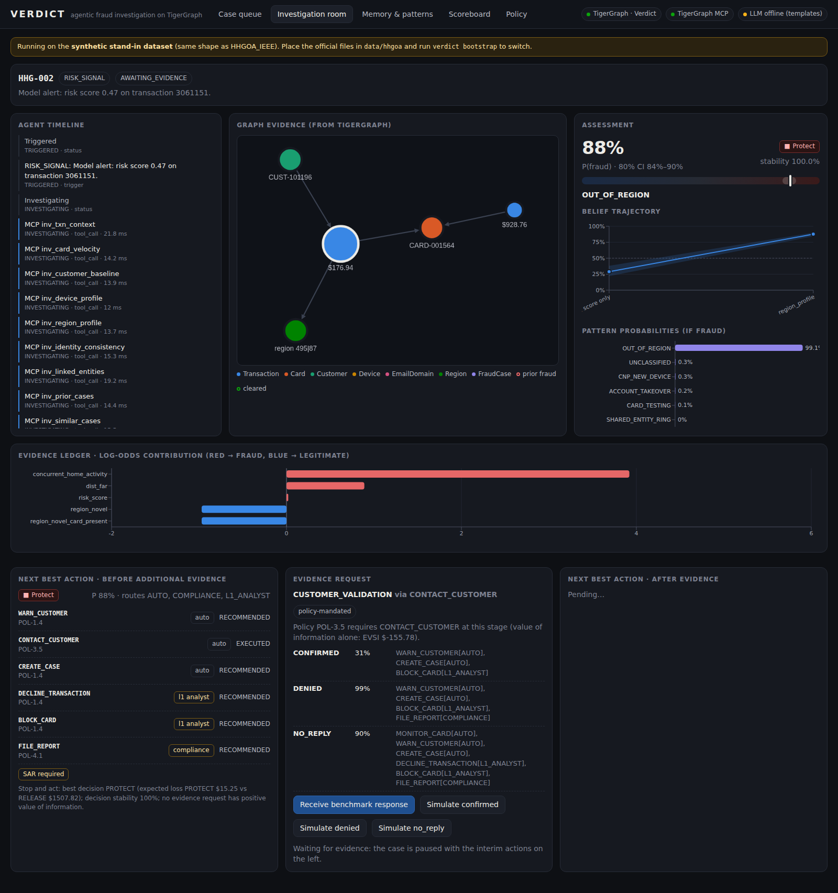
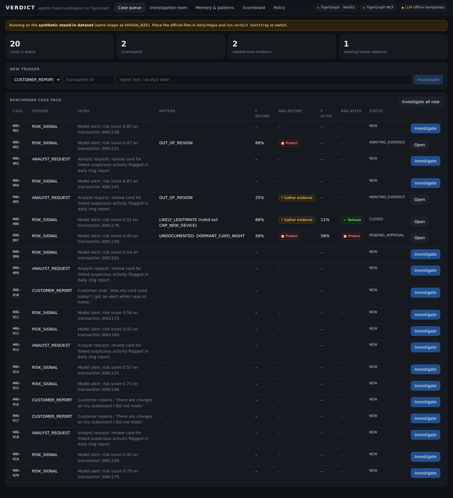
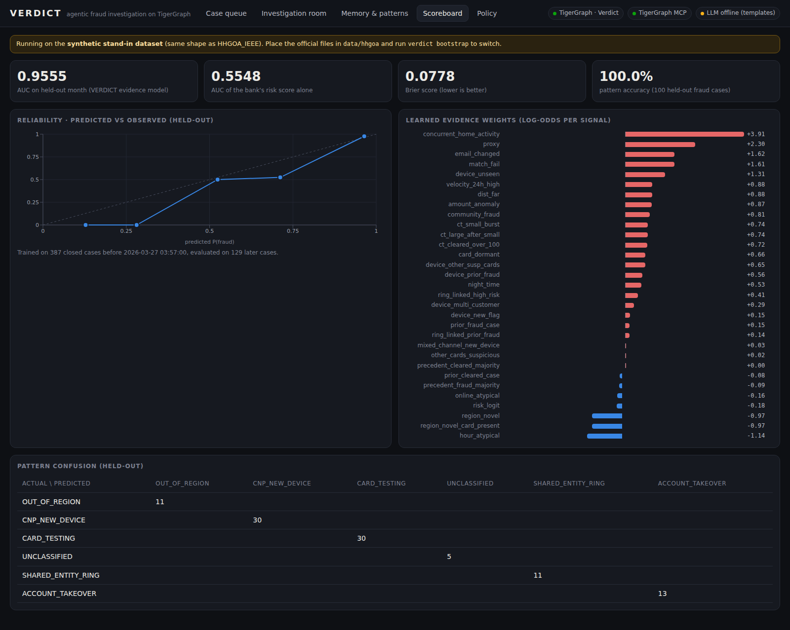
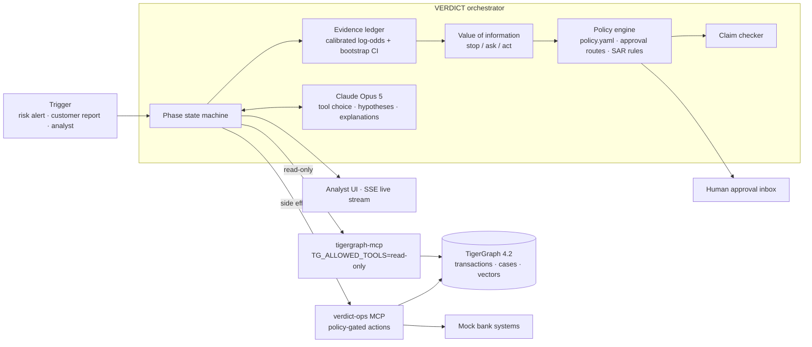

# VERDICT: agentic fraud investigation on TigerGraph

> **From an uncertain signal to a defensible action.**
> Built for the *TigerGraph Agentic Fraud Investigation* challenge, Hacker House Goa 2026.



VERDICT is an AI fraud investigator. Given a trigger (a risk-score alert, a customer report or an analyst request), it:

1. **opens a case** and **investigates inside TigerGraph** through the official **TigerGraph MCP server**, using 14 installed GSQL queries and graph algorithms (WCC and Louvain over a card-to-card "shares entity" projection);
2. converts every finding into an entry in a **calibrated evidence ledger**. Each signal's weight is **learned from the bank's closed cases**, so P(fraud) is a calibrated probability with an 80% credible interval, not a vibe;
3. decides whether it knows enough using **value of information**. It requests evidence (step-up auth, customer validation, analyst input) only when the answer could **flip the decision** and is worth its cost, and records what it would do for **every possible answer** (counterfactual branches);
4. recommends **next best actions** through a **policy-as-code engine**, which is the final authority. Actions carry exact policy identifiers, clause citations and **approval routes**; high-impact actions wait in a **human approval inbox**. The LLM can recommend but **cannot execute**;
5. writes an **explainable case file** with the next best action before *and* after additional evidence, a **claim-checked SAR** when policy requires one, and a full audit trail. It writes the case **back to the graph as memory** that later investigations retrieve through **GraphRAG** (TigerVector plus graph structure);
6. **finds fraud patterns the policy doesn't document** by clustering the closed cases no known typology explains, and **learns from outcomes**: resolving a case refits the evidence model live.

| | |
|---|---|
|  |  |

---

## Architecture



**Phases:** `TRIGGERED → INVESTIGATING → ASSESSED → DECIDED (before evidence) → [AWAITING_EVIDENCE → REASSESSED] → DECIDED (after) → EXPLAINED → REMEMBERED → PENDING_APPROVAL | CLOSED`

The maths (ledger, value of information) and the rules (policy) are deterministic code. Claude decides *what else to look at*, weighs hypotheses and writes the explanation; its proposals go through the same policy gate as everything else. With no API key the whole system still runs end to end on deterministic templates.

## How TigerGraph is used

| Capability | Where |
|---|---|
| **Graph model**: Customer, Card, Transaction, Device, EmailDomain, Region, FraudCase, Evidence, EvidenceRequest, CaseAction, Pattern, DocChunk, FeatureStat | [`graph/schema.gsql`](graph/schema.gsql) |
| **14 installed GSQL queries**: card-testing velocity, customer baseline, device novelty and sharing, region novelty with concurrent home activity, identity consistency (ATO), ring detection through shared devices and recipient emails with hub suppression, prior cases, structural precedent (inverse-log-degree weighted overlap), community context, exposure | [`graph/queries/`](graph/queries) |
| **Graph algorithms**: a card-to-card `SHARES_ENTITY` projection built in GSQL, then TigerGraph GDS **WCC** and **Louvain** for fraud-ring communities | `admin_build_projection.gsql`, [`graph/algorithms/`](graph/algorithms) |
| **TigerVector**: policy, pattern and regulation clauses (`DocChunk.emb`) and case narratives (`FraudCase.emb`), searched with `vectorSearch()` | `rag_search.gsql`, [`verdict/rag/graphrag.py`](verdict/rag/graphrag.py) |
| **GraphRAG**: vector hits fused with graph-structural precedent (reciprocal rank fusion plus a same-pattern boost), then expanded through case edges to cards | `Retriever.context_pack` |
| **TigerGraph MCP**: the agent reaches the graph only through `tigergraph-mcp` (stdio), started with `TG_ALLOWED_TOOLS=read-only,run_installed_query`, plus a query allow-list in our client | [`verdict/agent/graph_gateway.py`](verdict/agent/graph_gateway.py) |
| **Case memory**: every investigation, with its evidence, requests, actions, pattern links and `SIMILAR_CASE` edges, is written back to the graph and is retrievable by later cases | [`verdict/memory/case_store.py`](verdict/memory/case_store.py) |

## Agentic capabilities

- **Tool use through MCP**: 11 core queries run first (about 160 ms in total), then Claude picks follow-ups (wider ring windows, precedent case records, policy look-ups) within a tool budget.
- **Uncertainty and stopping**: posterior with an 80% CI from 200 bootstrap refits, plus *decision stability*. Evidence is requested only when its expected value of sample information is positive **and** some outcome would change the decision.
- **Controlled evidence gathering**: `STEP_UP_AUTH`, `CONTACT_CUSTOMER` and `REQUEST_ANALYST_INFO`, either VOI-chosen or **policy-mandated** (for example "contact the customer before blocking out-of-region use"). Response likelihoods are learned from the history (for example P(customer denies | fraud) = 0.74 vs 0.07 | legit).
- **Next best action before and after evidence**, each with approval routes, a "what changed" delta and counterfactual branches.
- **Controls and permissions**: DB profile, MCP tool filter, query allow-list, policy gate (allowed / approval route / forbidden with clause) and human approval. `BLOCK_ALL_CARDS` is refused without evidence of a wider compromise (POL-3.8), and an undocumented pattern can't be auto-closed (POL-3.9).
- **Memory**: prior cases, structural precedent, vector precedent and a recurring-entity watch through the card projection. Resolving a case **refits the evidence model** and the UI shows the weight deltas.
- **Undocumented-pattern discovery**: residual clustering of confirmed fraud cases no documented signature explains, stored as `Pattern{status: HYPOTHESIS}`. On the synthetic set it recovers the hidden *dormant-card night-time reactivation* pattern.
- **Grounded outputs**: every number and identifier in LLM-written text (summary, SAR) must exist in the evidence store, or the text is rejected and regenerated or replaced by the template.

## Results

Everything below is measured on the **synthetic stand-in dataset** ([`verdict synth`](verdict/data/synth.py)), which has the same shape as HHGOA_IEEE. Re-run `verdict bootstrap` on the official data to refresh it.

| Metric | Value |
|---|---|
| Time-split backtest AUC (evidence model), held-out last 25% of closed cases | **0.956** |
| AUC of the bank's risk score alone, same cases | 0.555 |
| Brier score | 0.078 |
| Pattern accuracy on held-out fraud cases | 100% (100 cases) |
| 20-case pack: final decision correct | **20 / 20** |
| 20-case pack: pattern correct (incl. undocumented) | 19 / 20 |
| Cases where the agent requested evidence | 11 / 20 |

## Quickstart

### Option A: Docker (recommended)
```bash
cp .env.example .env                       # add ANTHROPIC_API_KEY to use Claude (optional)
docker compose up -d tigergraph            # first start takes ~2-3 minutes
docker compose run --rm verdict verdict synth             # or put the official files in data/hhgoa
docker compose run --rm verdict verdict bootstrap --init  # schema, load, queries, algorithms, calibration, GraphRAG
docker compose up -d verdict               # UI + API on http://localhost:8000
docker compose run --rm verdict verdict benchmark         # writes outputs/<dataset>/answers/*.json|md
```

### Option B: local Python + TigerGraph in Docker
```bash
./scripts/dev_tigergraph.sh                # TigerGraph CE 4.2.5 on :14240
python -m venv .venv && . .venv/bin/activate && pip install -e . tabulate
cp .env.example .env
verdict synth                              # skip when using the official data
verdict bootstrap --init                   # ~8 minutes (query installation dominates)
(cd ui && npm ci && npx vite build)
verdict serve                              # http://localhost:8000
verdict benchmark
```

Savanna works too: set `TG_HOST` and the credentials (or `TG_API_TOKEN`) in `.env` and run the same commands. Use TigerGraph 4.2+ for vector support.

### Hosted replay (Vercel)
The live agent needs TigerGraph, the MCP server and a long-running API, so it runs with Docker. For a shareable link,
`verdict export-demo` snapshots the stored investigations into `ui/public/demo/`, and Vercel serves the console as a
static, read-only replay (`vercel.json` builds `ui/` with `VITE_REPLAY=1`; `.vercelignore` keeps the Python agent out of
the static deploy). After a new benchmark run: `verdict export-demo`, commit and push, and Vercel redeploys.

### Using the official HHGOA_IEEE dataset
1. Put the files in `data/hhgoa/`. It's git-ignored; never commit the dataset.
2. Check the column names in [`verdict/data/schema_map.yaml`](verdict/data/schema_map.yaml) against the dataset README.
3. Transcribe the bank's action identifiers, approval routes, rules and SAR criteria into [`verdict/policy/policy.yaml`](verdict/policy/policy.yaml).
4. `verdict bootstrap`, then `verdict benchmark` → `outputs/hhgoa/answers/`.

## Answer files

`outputs/<dataset>/answers/<case_id>.json`, plus a readable `.md` twin and `benchmark_summary.md`:

- `case`: status, fraud pattern (documented, undocumented hypothesis or ruled out), risk assessment before and after, the **investigation record** (every graph query with args and latency, evidence ledger, belief trajectory, subgraph, precedents, timeline), decisions, actions log and summary
- `next_best_action.before_evidence` and `.after_evidence`: decision, actions with **approval routes**, policy refs, rationale, expected loss, value of information
- `next_best_action.evidence_requests` and `counterfactual_branches`
- `suspicious_activity_report` (when policy requires one) and `graph_write_back` (verified from the graph)

## Repository layout
```
graph/          schema, loading jobs, GSQL queries, GDS algorithms
verdict/
  data/         synthetic generator, schema map, prepare (raw -> canonical CSVs)
  tg/           TigerGraph client, loader, installer, algorithms
  scoring/      signal extraction, evidence ledger, value-of-information NBA engine
  calibrate/    model fitting on closed cases, bootstrap, pattern classifier, backtest
  policy/       policy.yaml + safe rule engine
  agent/        orchestrator, MCP gateway, Claude integration
  rag/          TigerVector ingestion + fused GraphRAG retriever
  memory/       case store (graph write-back), learning loop, pattern discovery
  ops_mcp/      verdict-ops MCP server + mock bank
  outputs/      answer files, SAR claim checker, benchmark runner
  api/          FastAPI + SSE
ui/             React analyst console (Vite, Cytoscape, Recharts)
tests/          policy, VOI and claim-checker unit tests
docs/           blog draft, demo script, social post, screenshots
```

## Models
- **`claude-opus-5`** for the investigator: tool selection, hypotheses, explanations and SAR narrative (adaptive thinking, structured outputs, prompt caching, server-side refusal fallback).
- **`claude-haiku-4-5`** as a cheap worker for bulk jobs such as naming discovered patterns.
- **Embeddings**: offline LSA (TF-IDF + SVD) by default; `VERDICT_EMBEDDER=fastembed` switches to BAAI/bge-small-en-v1.5.
- **No LLM in the numbers**: probabilities, VOI and policy are deterministic and auditable.

## What's next
Graph embeddings (FastRP) as extra precedent signals, a streaming trigger feed from Kafka into TigerGraph, per-segment loss models, and analyst-feedback-driven policy suggestions.
